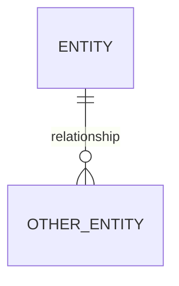

# 🚀 Database ER Diagram Construction using Large Language Models (LLMs)

> Leveraging Large Language Models to automatically generate structured ER diagrams from natural language database specifications.

---

## 📌 Project Overview

This project explores how **Large Language Models (LLMs)** such as **Llama3** and **Gemma2** can be used to automatically construct **Entity-Relationship (ER) diagrams** from structured natural language prompts.

The goal is to evaluate:

* How reliably LLMs can translate database requirements into formal schema representations.
* The quality and consistency of model-generated ER diagrams.
* The effectiveness of prompt engineering in structured output generation.

This work demonstrates practical applications of LLMs in:

* Automated database design
* Schema generation
* Structured code generation (Mermaid ER syntax)
* Prompt engineering for deterministic outputs

---

## 🎯 Motivation

Designing ER diagrams is a foundational step in database architecture. Traditionally, this requires:

* Manual analysis of requirements
* Logical entity extraction
* Relationship mapping
* Constraint definition

This project investigates whether LLMs can:

✔ Extract entities
✔ Identify attributes
✔ Infer primary and foreign keys
✔ Define relationships
✔ Output machine-readable diagram code

If successful, this approach can reduce design time and improve productivity in early-stage system design.

---

## 🧠 Models Used

The following open-source LLMs were evaluated:

* **Llama3**
* **Gemma2**
* Executed locally using **Ollama**

Each model was given the same structured prompt and instructed to output:

* Only Mermaid `erDiagram` syntax
* Strict ordering of entities
* Clearly defined keys and relationships
* No explanations (code-only output constraint)

---

## 🏗️ Project Structure

```
Database-ER-diagram-construction-using-LLMs/
│
├── OLLAMA Prompt.txt
├── OLLAMA prompt results (gemma2 + llama3).txt
├── ER diagram.png
├── README_Design_decision.pdf
└── Multi-LLM prompt result screenshot.pdf
```

### File Descriptions

| File                                          | Description                                                                              |
| --------------------------------------------- | ---------------------------------------------------------------------------------------- |
| `OLLAMA Prompt.txt`                           | Carefully engineered prompt used to instruct the LLM to generate a structured ER diagram |
| `OLLAMA prompt results (gemma2 + llama3).txt` | Raw outputs from both LLMs                                                               |
| `ER diagram.png`                              | Rendered ER diagram generated from model output                                          |
| `README_Design_decision.pdf`                  | Design decisions, assumptions, and reasoning                                             |
| `Multi-LLM prompt result screenshot.pdf`      | Visual comparison of multi-model outputs                                                 |

---

## 🛠️ Technical Approach

### 1️⃣ Prompt Engineering Strategy

The prompt was designed to:

* Explicitly define required entities
* Specify attribute types
* Define key constraints
* Enforce output format (Mermaid ER syntax only)
* Enforce ordering consistency

This reduced hallucination and improved structural reliability.

---

### 2️⃣ Structured Output Enforcement

Models were constrained to produce:



This ensured:

* Deterministic formatting
* Easy rendering
* Machine-readable schema representation

---

### 3️⃣ Model Evaluation Criteria

Outputs were evaluated on:

| Criteria              | Description                         |
| --------------------- | ----------------------------------- |
| Schema Completeness   | Were all entities included?         |
| Relationship Accuracy | Correct cardinality mapping         |
| Key Integrity         | Proper PK/FK usage                  |
| Format Compliance     | Strict Mermaid syntax adherence     |
| Hallucination Rate    | Extra/incorrect entities introduced |

---

## 📊 Observations & Insights

### 🔹 LLM Strengths

* Strong entity extraction
* Accurate identification of relationships
* Good compliance with structured output constraints
* Minimal formatting errors when prompt constraints were strict

### 🔹 Challenges Observed

* Occasional minor attribute inconsistencies
* Cardinality misinterpretation in edge cases
* Sensitivity to prompt wording

### 🔹 Key Insight

Prompt engineering significantly improves structured output reliability.
Clear constraints reduce hallucinations and improve deterministic formatting.

---

## 📷 Generated ER Diagram

Below is the final generated ER diagram:


---

## 🔬 Why This Project Matters

This project demonstrates practical LLM capabilities in:

* Automated schema generation
* Structured code generation
* Prompt engineering optimization
* Multi-model comparison
* AI-assisted system design

It reflects real-world applications such as:

* AI-powered developer assistants
* Schema prototyping tools
* Automated documentation systems
* Database reverse engineering

---

## 🧩 Skills Demonstrated

* Large Language Model experimentation
* Prompt engineering
* Structured generation control
* Schema design principles
* Comparative model evaluation
* AI system validation
* Local LLM deployment using Ollama

---

## 🚀 Future Improvements

* Add quantitative evaluation metrics (precision/recall on entity detection)
* Expand comparison to GPT-4 / Claude / Mistral
* Build an automated evaluation pipeline
* Develop a web interface for live schema generation
* Add validation layer to check ER correctness programmatically

---

## 🧪 How to Reproduce

1. Install Ollama:

   ```
   https://ollama.com
   ```

2. Pull models:

   ```
   ollama pull llama3
   ollama pull gemma:2b
   ```

3. Run:

   ```
   ollama run llama3
   ```

4. Paste the prompt from `OLLAMA Prompt.txt`

5. Capture the Mermaid output and render using:

   * Mermaid Live Editor
   * VSCode Mermaid plugin
   * Markdown preview tools

---

## 📈 Potential Extensions

This work can be extended toward:

* AI-powered database design assistants
* Schema-to-SQL generation pipelines
* Natural language to full-stack scaffolding
* ER validation using graph-based analysis
* LLM evaluation benchmarking frameworks

---

## 👨‍💻 Author

**Atharva Thorat**

Interested in:

* Artificial Intelligence
* Machine Learning
* Large Language Models
* Applied AI Systems
* AI for Software Engineering

---

## ⭐ If You’re a Recruiter or Hiring Manager

This project demonstrates:

✔ Practical LLM experimentation
✔ Structured output control
✔ AI system evaluation
✔ Real-world application mindset
✔ Independent research initiative

I am actively seeking opportunities in:

* AI Engineering
* Machine Learning Engineering
* LLM Research
* Applied AI Development

Feel free to connect!

